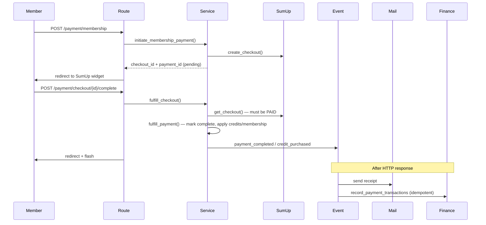

# Architecture

South East Archers is a server-rendered FastAPI application for club management: memberships, shoots, payments, and finance.

## Layer overview

```
HTTP request
    → routes/          (parse forms, call services, render templates)
    → services/        (business logic, ServiceResult)
    → repositories/    (SQLAlchemy queries)
    → models/          (ORM entities)
```

Side effects (email, ledger entries) go through **events** (`app/events/`) and run after the HTTP response is sent.

| Layer | May import | Must not import |
|-------|------------|-----------------|
| `routes/` | `services`, `schemas`, `dependencies` | `repositories`, `db`, `policies`, `events` |
| `services/` | `repositories`, `events` | `db.session` directly |
| `repositories/` | `db`, `models` | `routes`, `services` |
| `events/handlers/` | `services` | `repositories` |
| `schemas/` | Pydantic, enums | `services`, `routes` |

Boundaries are enforced by [import-linter contracts](pyproject.toml).

## Database session rules

SQLAlchemy uses a **sync** session stored in a `ContextVar` (`app/db/session.py`).

| Context | Session lifecycle |
|---------|-------------------|
| HTTP requests | `Depends(get_db)` on `api_router` opens a session per request |
| Deferred event handlers | `run_handler_with_session()` opens a fresh session after the response |
| CLI / scheduler | `app/cli` opens and closes its own session |
| Tests | `conftest.py` uses transaction rollback per test |

Repositories call `db.session` implicitly. When adding code outside HTTP requests, ensure a session is active or use `BaseRepository.transaction()`.

## ServiceResult

Services return `ServiceResult[T]` (`app/services/result.py`):

- `success` / `message` / optional `data` / `error_code` / `warnings`
- Routes check `result.success` and flash messages; some admin routes map `ErrorCode.NOT_FOUND` to HTTP 404

## Payment flow



### Cash payments

1. Member submits cash request → `initiate_cash_*` creates pending payment, commits, then emits `cash_payment_submitted` (pending email).
2. Admin approves → `approve_cash_payment` → `fulfill_payment` → `payment_completed` → mail + ledger.

### Admin reconciliation (SumUp)

If a member paid via SumUp but checkout completion failed (lost session), pending online payments with a stored `sumup_checkout_id` appear on **Admin → Reconcile Online Payments**. Admin verifies status with SumUp and fulfills manually.

### Handler replay (recovery)

If a completed payment is missing its receipt or ledger entry after a deferred handler failure, replay side effects:

- **CLI:** `uv run sea payments replay-side-effects PAYMENT_ID` (`--no-mail` for ledger only)
- **Admin:** Reconcile page → “Replay side effects” form

Ledger recording is idempotent on replay.

### Idempotency

- Ledger: `receipt_reference` + category + type (DB unique constraint)
- SumUp txn: `external_transaction_id` unique on `payments`
- Cash: `cash-payment-{payment_id}` receipt reference
- Fulfillment: `fulfill_payment()` no-ops when status is already `completed`

## Events

Signals live in `app/events/__init__.py`. Handlers in `app/events/handlers.py` call `mail` and `finance` services only.

**Emit events only after a successful commit** (see `users.create_user` and cash payment initiation).

In production, handlers are deferred to a background thread after the response. In tests (`APP_ENV=testing`), they run synchronously in middleware.

## Adding a feature (checklist)

1. Schema in `app/schemas/` if the route accepts form input
2. Service method returning `ServiceResult`
3. Repository method if the query is non-trivial
4. Route with `CsrfFormData` on POST and `require_perms()` on admin routes
5. Unit test for service logic; feature test for HTTP happy path
6. Event + handler only if the action sends email or writes to the ledger

## Testing

| Suite | Location | Database |
|-------|----------|----------|
| Unit | `tests/unit/` | SQLite in-memory (`create_all`) |
| Feature | `tests/feature/` | SQLite in-memory |
| Integration | `tests/integration/` | MySQL via `TEST_DATABASE_URL` (CI) |

CI runs `alembic upgrade head` before tests so production schema parity is validated.

## Configuration

See `.env.example`. Production requires `SECRET_KEY`, MySQL `DATABASE_URL`, `MAIL_SERVER`, and `REDIS_URL` (multi-worker rate limiting).
